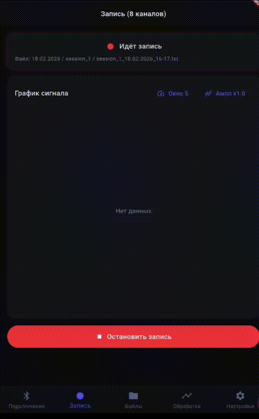
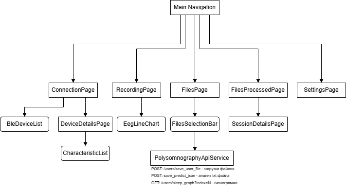

# EEG Recording App

A mobile Flutter application designed for polysomnography — comprehensive sleep studies.  
The app records EEG signals from BLE devices, manages recording sessions, and integrates with a polysomnography service for automatic sleep stage analysis and hypnogram generation.

## About the Application

The application is built for clinical and research sleep diagnostics. It supports full-cycle EEG acquisition during overnight sleep studies, including signal processing and server-based sleep stage prediction.

Supported features:

- Bluetooth Low Energy EEG device connection
- Real-time EEG data streaming and visualization
- Recording in TXT / CSV formats
- Uploading recordings to a polysomnography server
- Receiving sleep stage predictions (N1, N2, N3, REM, Wake)
- Hypnogram visualization and stage interval display

This application is intended for:

- Sleep laboratory environments
- Clinical EEG data acquisition
- Experimental sleep stage research
- Automated hypnogram generation workflows

## Core Features

### BLE Device Connection

- Scanning and connecting to EEG BLE devices
- Real-time connection state monitoring
- Custom device command support

### EEG Recording

- Stream-based recording with buffering and time-based rotation
- TXT / CSV file formats
- int24Be format support (up to 8 channels)
- **50 Hz Notch Filter** — power-line noise suppression for clinical accuracy
- Foreground service — continuous recording when the app is minimized

### Signal Visualization

- Real-time display of up to 8 EEG channels
- Sliding window (3 / 5 / 10 seconds)
- Adjustable amplitude scaling



### File Management

- Session and directory browsing
- File and folder deletion with session counter synchronization
- TXT preview and sharing support

### Polysomnography Integration

- **FilesPage** — upload selected recordings  
  `POST /users/save_user_file`

- **ProcessedFilesPage** — trigger prediction processing  
  `POST /users/save_predict_json`

- **SessionDetailsPage**
  - Fetch hypnogram image  
    `GET /users/sleep_graph?index=N`
  - Display sleep stage intervals

## Data Requirements for Polysomnography

To ensure correct analysis by server-side models, the following parameters must be configured:

| Parameter | Required Value |
|------------|----------------|
| **Sampling Frequency** | 100 Hz |
| **Power-Line Filter** | 50 Hz Notch |
| **Channels (TXT)** | 1 channel |

Before recording:

- Set sampling frequency to **100 Hz**
- 50 Hz notch filter is applied automatically during recording

## Screen Flow



Connection → Recording → File Management → Processed Sessions → Session Details

The navigation follows a structured clinical workflow from device setup to sleep analysis review.

## Data Architecture

### EEG Recording Pipeline
```
BLE Device (notify)
    ↓
BleController.selectedDataCharacteristic.lastValueStream
    ↓
RecordingController.onDataReceived(bytes)
    ↓
EegParserService.parseAllBytes() → List<EegSample> (int24Be)
    ↓
Notch50HzFilter.process() 
    ↓
CsvStreamWriter.writeSample() 
    ↓
Файл: dd.MM.yyyy/session_N/session_N_dd.MM.yyyy_HH-mm.txt
```

### Polysomnography Integration Flow

```
TXT/EDF (1 канал, 100 Гц, фильтр 50 Гц)
    ↓
POST /users/save_user_file (patient_id, patient_name, sampling_frequency for .txt)
    ↓
POST /users/save_predict_json (patient_id, file_index, channel for .edf)
    ↓
PredictResult(prediction, jsonIndex)
    ↓
GET /users/sleep_graph?index=N → PNG hypnogramm
    ↓
SessionDetailsPage
```

## Installation & Setup

### Requirements

- Flutter SDK 3.10+
- Android 5.0+ / iOS 11+ (для BLE и записи)

### Installation

1. Клонируйте репозиторий и перейдите в каталог:
   ```bash
   cd eeg-recording-app
   ```

2. Установите зависимости:
   ```bash
   flutter pub get
   ```

3. Запустите приложение:
   ```bash
   flutter run
   ```

## Polysomnography Server Configuration

1. Open:  
   **Settings → Polysomnography → Server Address**

2. Enter your API URL, for example: `http://192.168.0.174:8000/`

The default server address is defined in: `lib/core/constants/polysomnography_constants.dart`

If your local network IP address changes, update the server address accordingly.

## Project Structure

```
lib/
├── main.dart
├── core/
│   ├── constants/
│   │   ├── ble_constants.dart
│   │   ├── recording_constants.dart
│   │   └── polysomnography_constants.dart
│   ├── theme/
│   │   └── app_theme.dart
│   ├── utils/
│   │   ├── format_extensions.dart
│   │   └── signal_filters.dart           # Notch50HzFilter
│   └── common/
│       ├── eeg_sample.dart
│       └── recording_models.dart
│
└── features/
    ├── ble/                             # BLE connection
    ├── recording/                       # Recording and EEG visualization
    ├── files/                           # File management
    ├── polysomnography/                 # Polysomnography server integration
    ├── settings/                        # Settings: EEG, Server, BLE, Files Manager
    └── navigation/                      # App navigation
```

## Dependencies

| Package | Purpose |
|----------|----------|
| flutter_blue_plus | BLE connectivity |
| fl_chart | Signal visualization |
| flutter_foreground_task | Background recording |
| dio | REST API communication |
| http | Lightweight HTTP requests |
| get | State management and navigation |


