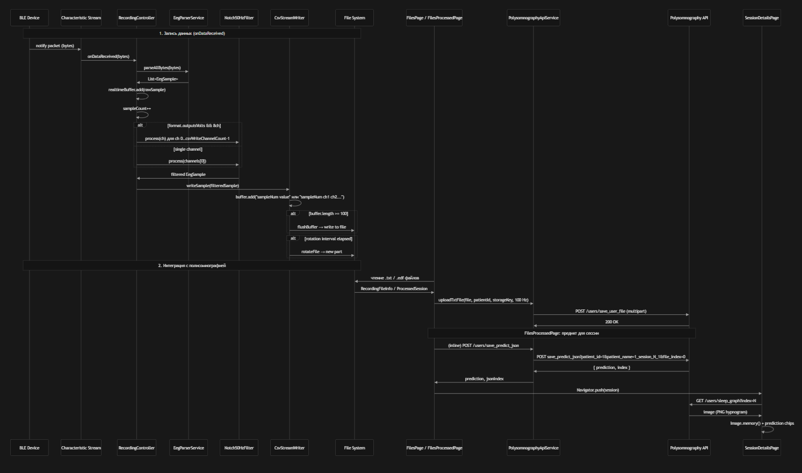

# EEG Recording App

Мобильное Flutter‑приложение для регистрации ЭЭГ‑сигналов с BLE‑устройств, управления записями и интеграции с сервисом полисомнографии для анализа сна. Поддерживает подключение по Bluetooth Low Energy, приём и визуализацию данных в реальном времени, запись в txt/csv, просмотр файлов и получение предсказаний стадий сна.

## Структура экранов приложения


Схема навигации и страницы: подключение к устройствам, запись, управление файлами и обработанными сессиями.

## Поток данных



Диаграмма последовательности: от BLE‑устройства до сервиса полисомнографии (запись, загрузка, предикт, гипнограмма).

## Основные возможности

- **Подключение к BLE‑устройствам**
  - Сканирование и подключение к EEG BLE‑устройствам
  - Отслеживание состояния подключения

- **Запись ЭЭГ в реальном времени**
  - Потоковая запись в txt/csv с буферизацией и ротацией по времени
  - Поддержка форматов: int8, uint12Le, int24Be (8 каналов)
  - Фильтр Notch 50 Гц для данных, используемых в полисомнографии
  - Foreground service для записи при свёрнутом экране

- **Онлайн‑визуализация сигналов**
  - Отображение сигналов в реальном времени (до 8 каналов)
  - Скользящее окно (3/5/10 с) и регулировка масштаба амплитуды

- **Работа с файлами**
  - Просмотр списка записей и директорий
  - Удаление файлов/папок с синхронизацией счётчика сессий
  - Шаринг и просмотр содержимого txt

- **Интеграция с полисомнографией**
  - **FilesPage**: загрузка выбранных файлов на сервер (POST `/users/save_user_file`)
  - **FilesProcessedPage**: загрузка всех файлов сессии → предикт (POST `/users/save_predict_json`)
  - **SessionDetailsPage**: гипнограмма (GET `/users/sleep_graph?index=N`), интервалы стадий сна

- **Настройки**
  - Папка для записей, интервал ротации, формат данных (int8, uint12Le, int24Be), число каналов, а также настройка и отправка кастомных команд на устройство

---

## Архитектура данных

### Запись ЭЭГ

```text
BLE Device (notify)
    ↓
BleController.selectedDataCharacteristic.lastValueStream
    ↓
RecordingController.onDataReceived(bytes)
    ↓
EegParserService.parseAllBytes() → List<EegSample> (int8/uint12Le/int24Be)
    ↓
Notch50HzFilter.process() — подавление 50 Гц
    ↓
CsvStreamWriter.writeSample() → buffer → flush при 100 строках
    ↓
File: dd.MM.yyyy/session_N/session_N_dd.MM.yyyy_HH-mm.txt
```

### Интеграция с полисомнографией

```text
txt/edf файлы сессии
    ↓
POST /users/save_user_file (patient_id=1, patient_name=1_session_N_i, 100 Гц)
    ↓
POST /users/save_predict_json (file_index=0) → { prediction, index }
    ↓
ProcessedSession(prediction, jsonIndex)
    ↓
GET /users/sleep_graph?index=N → PNG гипнограмма
    ↓
SessionDetailsPage: Image + chips с интервалами стадий
```

---

## Установка и запуск

1. Установите Flutter SDK (рекомендуется 3.10+)
2. Установите зависимости:

   ```bash
   flutter pub get
   ```

3. Запустите приложение:

   ```bash
   flutter run
   ```

Для интеграции с полисомнографией укажите URL сервера в `lib/core/polysomnography_constants.dart` 

---

## Структура проекта

```text
lib/
├── main.dart
├── controllers/
│   ├── ble_controller.dart         # BLE: сканирование, подключение
│   ├── recording_controller.dart   # запись, парсинг, фильтр, CsvStreamWriter
│   ├── settings_controller.dart    # настройки (SharedPreferences)
│   └── files_controller.dart       # файлы, сессии
│
├── services/
│   ├── csv_stream_service.dart     # потоковая запись txt с ротацией
│   ├── eeg_parser_service.dart     # парсинг bytes → EegSample (int8/12/24)
│   ├── eeg_foreground_service.dart # foreground task при записи
│   └── polysomnography_service.dart# uploadTxtFile (save_user_file)
│
├── models/
│   ├── eeg_models.dart             # EegSample, DataFormat
│   ├── recording_models.dart       # RecordingFileInfo, CsvRecordingMetadata
│   └── processed_session_models.dart# ProcessedSession, PredictionStatus
│
├── views/
│   ├── main_navigation.dart       # BottomNavigationBar, IndexedStack
│   ├── connection_page.dart       # сканирование, список устройств
│   ├── device_details_page.dart   # характеристики, команды
│   ├── recording_page.dart        # график, управление записью
│   ├── files_page.dart            # файлы, загрузка в полисомнографию
│   ├── files_processed_page.dart  # сессии, предикт, переход к деталям
│   ├── session_details_page.dart  # гипнограмма, интервалы стадий
│   ├── csv_view_page.dart         # просмотр txt/csv
│   └── settings_page.dart         # настройки
│
├── widgets/
│   ├── device_list.dart
│   ├── characteristic_list.dart
│   ├── device_control_section.dart
│   ├── eeg_plots.dart
│   ├── recording_status_card.dart
│   └── files_selection_bar.dart
│
├── core/
│   ├── ble_constants.dart
│   ├── recording_constants.dart
│   └── polysomnography_constants.dart
│
└── utils/
    ├── extension.dart             # DataFormat, DateTime.format, ...
    └── signal_filters.dart         # Notch50HzFilter
```
