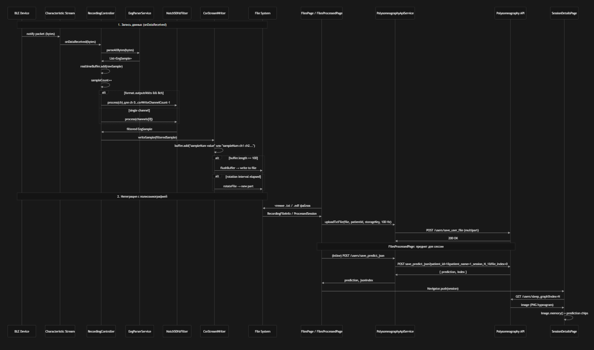

# EEG Recording App (Sleep Recording)

Мобильное Flutter-приложение для записи ЭЭГ с BLE-устройства, управления сессиями записи и интеграции с сервисом полисомнографии (загрузка данных, запуск обработки и просмотр гипнограммы).


## Возможности

- BLE: сканирование, подключение, мониторинг состояния соединения, отправка команд устройству
- Запись: потоковая запись в файл с буферизацией и ротацией по времени, запись в фоне (Android foreground service)
- Визуализация: график сигнала в реальном времени
- Файлы: просмотр сессий/директорий, удаление, шаринг, просмотр содержимого TXT/CSV
- Полисомнография: загрузка записей на сервер, запуск обработки, отображение гипнограммы/интервалов

## Быстрый старт

**Требования:** Flutter SDK (Dart `^3.10.7`), устройство/эмулятор с поддержкой Bluetooth LE.

```bash
flutter pub get
flutter run
```

Полезно для проверки:

```bash
flutter analyze
flutter test
```

## Как пользоваться (коротко)

1. Откройте страницу BLE, найдите устройство и подключитесь.
2. На странице записи запустите запись (приложение подписывается на notify/indicate-характеристику и отправляет команды `start/stop`).
3. Записи сохраняются в выбранную папку (см. «Настройки → Запись»), автоматически разбиваются по интервалу ротации.
4. На странице файлов можно открыть/удалить/поделиться файлами и отправить запись в сервис полисомнографии.

## Настройки

Настройки доступны в приложении (страница **Настройки**):

- **Папка для записей**: кастомный путь или Documents-директория приложения
- **Частота дискретизации**: 100 / 250 / 500 Гц (команды `d100`, `d250`, `d500`)
- **Интервал разбиения**: ротация файла по времени (по умолчанию 20 минут)
- **Адрес сервера**: базовый URL сервиса полисомнографии (по умолчанию `http://192.168.0.173:8000`)

Примечание: сейчас запись сохраняется в формате **polysomnography** (одно значение вольт на строку). CSV-формат поддержан в коде, но переключатель формата не выведен в UI.

## Форматы данных

### Polysomnography (`.txt`)

- 1 значение (вольты) на строку
- строки, начинающиеся с `#`, игнорируются при загрузке на сервер
- при отправке на сервер `.txt` автоматически ресемплируется до **100 Гц** (если частота отличается; исходная частота берется из суффикса имени файла `_*hz`)

### CSV (поддержано в коде)

Строка: `absoluteTimestampMs,header,battery,sequence,dataMsb,dataMid,dataLsb,footer,rawValue,volts`

## Куда сохраняются записи

Корень записей выбирается в настройках. Внутри создается структура:

```
<recordings_root>/
  dd.MM.yyyy/
    session_N/
      session_N_<hz>hz_dd.MM.yyyy_HH-mm.txt
```

Примечания:

- `<hz>` берется из выбранной в настройках частоты и используется сервисом полисомнографии при ресемплинге.
- При ротации по времени создаются новые файлы с новым суффиксом даты/времени.

## Полисомнография (API)

Интеграция с сервером реализована через эндпоинты:

- загрузка файла: `POST /users/save_user_file` (query: `patient_id`, `patient_name`, `sampling_frequency` для `.txt`)
- список файлов пациента: `GET /users/get_patient_files_list?patient_id=N`
- запуск обработки: `POST /users/save_predict_json` (query: `patient_id`, `file_index`, `channel`)
- гипнограмма: `GET /users/sleep_graph?index=N`

## BLE-устройство (по умолчанию)

В коде заложены UUID для «EEG Headset»:

- Service: `0000fff0-0000-1000-8000-00805f9b34fb`
- Data (notify/indicate): `0000fff1-0000-1000-8000-00805f9b34fb`
- Command (write): `0000fff2-0000-1000-8000-00805f9b34fb`
- Config: `0000fff3-0000-1000-8000-00805f9b34fb`

Команды: `ping`, `start`, `stop`, `d100`, `d250`, `d500`.

## Навигация




## Структура проекта

Ключевые каталоги:

```
lib/
  core/        # константы, тема, утилиты
  features/    # ble, recording, files, polysomnography, settings, navigation
  main.dart
```
