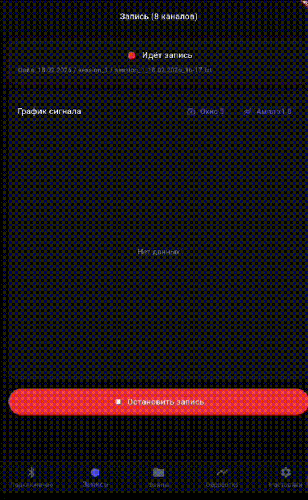
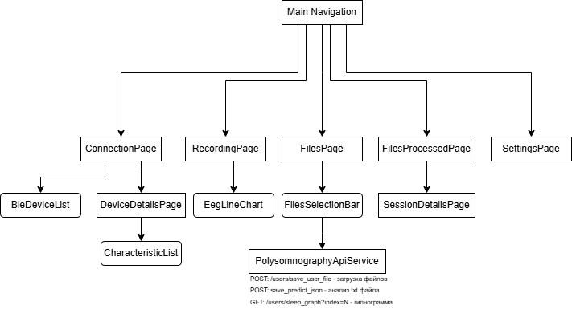

# EEG Recording App 


This is a mobile Flutter app for recording EEG data from a BLE device. It allows you to manage recording sessions and connect to a polysomnography service (upload data, start processing, and view a hypnogram).

## Features
- BLE: scan devices, connect, check connection status, send commands
- Recording: record data stream to a file with buffering and time splitting, background recording (Android foreground service)
- Visualization: real-time signal graph
- Files: view sessions and folders, delete, share, open TXT/CSV files
- Polysomnography: upload recordings, start processing, view hypnogram and intervals
- 
## Quick start

**Requirements:** Flutter SDK (Dart ^3.10.7), a device or emulator with Bluetooth LE, and a sleep analysis service based on the AttnSleep neural network.

```bash
flutter pub get
flutter run
```

Полезно для проверки:

```bash
flutter analyze
flutter test
```

## How to use

1. Open the BLE page, find your device, and connect.
2. Go to the recording page and start recording (the app subscribes to BLE notifications and sends start/stop commands).
3. Files are saved in the selected folder (see “Settings → Recording”) and are split automatically by time.
4. On the files page, you can open, delete, share files, or send them to the polysomnography service.

## Vizualization



## Settings

Settings are available in the Settings page:

- Recording folder: custom path or app Documents folder
- Sampling rate: 100 / 250 / 500 Hz (commands d100, d250, d500)
- Split interval: file is split by time (default: 20 minutes)
- Recording format:
- - .csv — CSV with BLE data and calculated voltage
- - .txt — same CSV but with .txt extension
- polysomnography — .txt with one voltage value per line
- Server address: base URL of the polysomnography service

## Where Files Are Saved

The root folder is selected in settings. Inside, the structure is:
```
<recordings_root>/
  dd.MM.yyyy/
    session_N/
      session_N_<hz>hz_dd.MM.yyyy_HH-mm.csv
```

Примечания:

Notes:

- <hz> is taken from the selected sampling rate and is used by the polysomnography service.
- When the file is split by time, new files are created with a new date/time in the name.

## Navigation



## Project Structure

Main folders:

```
lib/
  core/        # constants, theme, utilities
  features/    # ble, recording, files, polysomnography, settings, navigation
  main.dart
```
